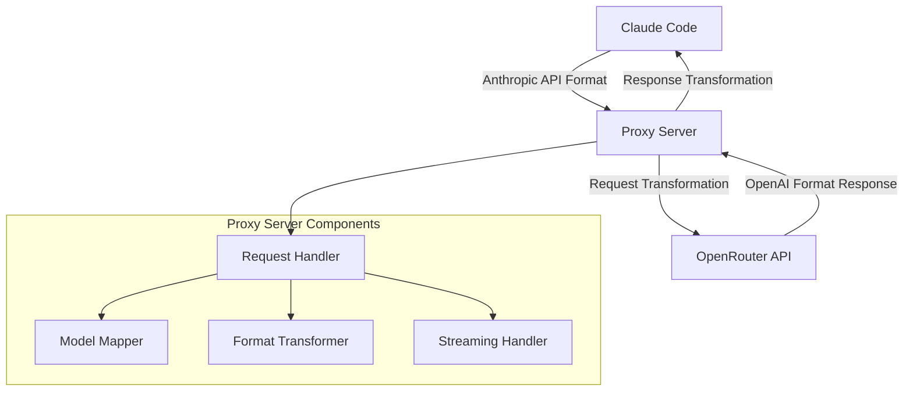

# Proxy Server for Claude Code

A Flask-based proxy server that enables Claude Code to work with OpenRouter models by transforming API requests between Anthropic's format and OpenRouter's OpenAI-compatible format. This solution resolves litellm API key issues and provides seamless integration between Claude Code and OpenRouter's diverse model ecosystem.

## Table of Contents

- [Overview](#overview)
- [Architecture](#architecture)
- [Features](#features)
- [Prerequisites](#prerequisites)
- [Installation](#installation)
- [Configuration](#configuration)
- [Usage](#usage)
- [API Endpoints](#api-endpoints)
- [Model Mapping](#model-mapping)
- [Deployment](#deployment)
- [Troubleshooting](#troubleshooting)
- [Security Considerations](#security-considerations)
- [Contributing](#contributing)
- [License](#license)

## Overview

The Claude Code Proxy Server addresses a critical limitation where Claude Code requires Anthropic API keys, but users may want to leverage OpenRouter's extensive model catalog and competitive pricing. This proxy server acts as a middleware layer that:

1. **Intercepts** Claude Code's Anthropic-format API requests
2. **Transforms** them to OpenRouter's OpenAI-compatible format
3. **Forwards** requests to OpenRouter with proper authentication
4. **Converts** responses back to Anthropic's expected format
5. **Returns** responses to Claude Code seamlessly

### Key Benefits

- **Bypass API Key Limitations**: Use OpenRouter models without Anthropic API keys
- **Cost Optimization**: Access free and low-cost models through OpenRouter
- **Model Diversity**: Leverage OpenRouter's extensive model catalog
- **Seamless Integration**: Works transparently with existing Claude Code installations
- **Streaming Support**: Full support for real-time streaming responses
- **Easy Deployment**: Simple Flask application with minimal dependencies

## Architecture



### How It Solves litellm API Key Issues

The proxy server resolves authentication limitations by:

1. **Accepting** Claude Code's requests with Anthropic-style authentication
2. **Replacing** authentication headers with OpenRouter API keys
3. **Transforming** request payloads between API formats
4. **Maintaining** compatibility with Claude Code's expected response structure

This approach eliminates the need for:
- Direct Anthropic API access
- Complex litellm configuration
- Multiple authentication systems

## Features

- ✅ **Format Translation**: Seamless conversion between Anthropic and OpenRouter API formats
- ✅ **Streaming Support**: Real-time response streaming for interactive sessions
- ✅ **Model Mapping**: Intelligent mapping between Claude model names and OpenRouter equivalents
- ✅ **Error Handling**: Comprehensive error handling and reporting
- ✅ **Health Checks**: Built-in health check endpoint for monitoring
- ✅ **Verbose Logging**: Optional detailed logging for debugging
- ✅ **Production Ready**: Gunicorn-compatible for production deployments

## Prerequisites

- Python 3.7 or higher
- pip package manager
- OpenRouter API account and key
- Claude Code installation (optional, for testing)

### Account Setup

#### 1. OpenRouter Account

1. Visit [OpenRouter.ai](https://openrouter.ai/)
2. Sign up for a free account
3. Navigate to the API Keys section
4. Generate a new API key
5. Copy the key for configuration

#### 2. Claude Code (Optional)

If you haven't already installed Claude Code:

```bash
# Install via pip
pip install claude-code

# Or via npm
npm install -g claude-code
```

## Installation

### 1. Clone or Download the Project

```bash
# Clone the repository
git clone <repository-url>
cd openrouter-claude-proxy-server

# Or download the Python file directly
curl -O https://raw.githubusercontent.com/<repo>/openrouter_proxy_server_claude_code_v1.0.py
```

### 2. Create Virtual Environment

```bash
# Create virtual environment
python3 -m venv claude-proxy-env

# Activate virtual environment
# On macOS/Linux:
source claude-proxy-env/bin/activate
# On Windows:
claude-proxy-env\Scripts\activate
```

### 3. Install Dependencies

```bash
# Install required packages
pip install flask requests

# Or install from requirements.txt (if available)
pip install -r requirements.txt
```

### 4. Verify Installation

```bash
# Check that Python and required packages are installed
python --version
pip list | grep -E "(flask|requests)"
```

## Configuration

### Environment Variables

Create a `.env` file or set environment variables in your shell:

```bash
# Required: Your OpenRouter API key
export OPENROUTER_API_KEY="sk-or-v1-your-api-key-here"

# Optional: Enable verbose logging for debugging
export PROXY_VERBOSE="true"

# Optional: Custom port (default: 8000)
export PROXY_PORT="8000"
```

### Shell Configuration (Recommended)

Add these to your shell profile (`~/.zshrc`, `~/.bashrc`, etc.):

```bash
# OpenRouter Configuration
export OPENROUTER_API_KEY="sk-or-v1-your-actual-api-key"
export PROXY_VERBOSE="false"  # Set to "true" for debugging
```

Then reload your shell:

```bash
# On macOS/Linux
source ~/.zshrc  # or ~/.bashrc
```

### Claude Code Configuration

Configure Claude Code to use the proxy server:

```bash
# Set the API base URL to point to your proxy
export ANTHROPIC_API_BASE_URL="http://localhost:8000/anthropic"

# Set a dummy API key (won't be used, but required by Claude Code)
export ANTHROPIC_API_KEY="dummy-key-for-claude-code"
```

## Usage

### Starting the Proxy Server

#### Development Mode

```bash
# Start the server in development mode
python openrouter_proxy_server_claude_code_v1.0.py
```

#### Production Mode

```bash
# Start with Gunicorn (recommended for production)
gunicorn --bind 0.0.0.0:8000 --workers 4 --timeout 120 openrouter_proxy_server_claude_code_v1.0:app
```

### Testing the Proxy Server

#### 1. Health Check

```bash
# Test that the server is running
curl http://localhost:8000/health
```

Expected response:
```json
{"status": "healthy", "service": "claude-code-proxy"}
```

#### 2. API Test

```bash
# Test the proxy with a simple request
curl -X POST http://localhost:8000/v1/messages \
  -H "Content-Type: application/json" \
  -d '{
    "model": "claude-sonnet",
    "messages": [{"role": "user", "content": "Hello, world!"}],
    "max_tokens": 100
  }'
```

#### 3. Claude Code Integration Test

```bash
# Test with Claude Code (if installed)
claude-code --model claude-sonnet "Hello, can you help me with Python?"
```

### Example Usage Scenarios

#### Basic Chat

```python
import requests

# Send a message through the proxy
response = requests.post(
    "http://localhost:8000/v1/messages",
    headers={"Content-Type": "application/json"},
    json={
        "model": "claude-sonnet",
        "messages": [
            {"role": "user", "content": "Explain quantum computing in simple terms"}
        ],
        "max_tokens": 500
    }
)

print(response.json())
```

#### Streaming Response

```python
import requests
import json

# Stream a response
response = requests.post(
    "http://localhost:8000/v1/messages",
    headers={"Content-Type": "application/json"},
    json={
        "model": "claude-sonnet",
        "messages": [
            {"role": "user", "content": "Write a short story about AI"}
        ],
        "max_tokens": 1000,
        "stream": True
    },
    stream=True
)

for line in response.iter_lines():
    if line:
        decoded_line = line.decode('utf-8')
        if decoded_line.startswith('data: '):
            data_str = decoded_line[6:]
            if data_str != '[DONE]':
                try:
                    data = json.loads(data_str)
                    print(data.get('delta', {}).get('text', ''), end='')
                except json.JSONDecodeError:
                    continue
```

## API Endpoints

### `/v1/messages` and `/anthropic/v1/messages`

**Method**: `POST`

**Description**: Main proxy endpoint that transforms requests between Claude Code and OpenRouter.

**Request Body**:
```json
{
  "model": "claude-sonnet",
  "messages": [
    {
      "role": "user",
      "content": "Your message here"
    }
  ],
  "max_tokens": 1000,
  "temperature": 0.7,
  "stream": false
}
```

**Response**:
```json
{
  "id": "msg_abc123def456...",
  "type": "message",
  "role": "assistant",
  "content": [
    {
      "type": "text",
      "text": "The assistant's response"
    }
  ],
  "model": "claude-sonnet",
  "stop_reason": "end_turn",
  "stop_sequence": null,
  "usage": {
    "input_tokens": 10,
    "output_tokens": 50
  }
}
```

### `/health`

**Method**: `GET`

**Description**: Health check endpoint for monitoring.

**Response**:
```json
{
  "status": "healthy",
  "service": "claude-code-proxy"
}
```

## Model Mapping

The proxy server intelligently maps Claude model names to OpenRouter equivalents:

| Claude Model | OpenRouter Model | Description |
|--------------|------------------|-------------|
| `claude-sonnet-4-5-20250929` | `openai/gpt-oss-120b:free` | Free high-capacity model |
| `claude-haiku-4-5-20251001` | `openai/gpt-oss-120b:free` | Free model for quick tasks |
| `claude-sonnet` | `openai/gpt-oss-120b:free` | Default Sonnet mapping |
| `claude-opus` | `openai/gpt-oss-20b:free` | Free Opus-equivalent |
| `claude-haiku` | `moonshotai/kimi-k2:free` | Free Haiku-equivalent |

### Custom Model Mapping

You can modify the model mapping in the code by editing the `model_mapping` dictionary:

```python
model_mapping = {
    "claude-sonnet": "anthropic/claude-3-sonnet",
    "claude-opus": "anthropic/claude-3-opus",
    "claude-haiku": "anthropic/claude-3-haiku",
    # Add your custom mappings here
}
```

## Deployment

### Development Deployment

```bash
# Simple Flask development server
python openrouter_proxy_server_claude_code_v1.0.py
```

### Production Deployment with Gunicorn

#### Basic Gunicorn Configuration

```bash
# Install Gunicorn
pip install gunicorn

# Start the server
gunicorn --bind 0.0.0.0:8000 --workers 4 --timeout 120 openrouter_proxy_server_claude_code_v1.0:app
```

#### Advanced Gunicorn Configuration

Create a `gunicorn.conf.py` file:

```python
# gunicorn.conf.py
bind = "0.0.0.0:8000"
workers = 4
worker_class = "sync"
worker_connections = 1000
timeout = 120
keepalive = 2
max_requests = 1000
max_requests_jitter = 100
preload_app = True
```

Then start with:

```bash
gunicorn --config gunicorn.conf.py openrouter_proxy_server_claude_code_v1.0:app
```

#### Systemd Service (Linux)

Create a systemd service file `/etc/systemd/system/claude-proxy.service`:

```ini
[Unit]
Description=Claude Code Proxy Server
After=network.target

[Service]
Type=exec
User=your-username
Group=your-group
WorkingDirectory=/path/to/openrouter-claude-proxy-server
Environment=PATH=/path/to/openrouter-claude-proxy-server/claude-proxy-env/bin
Environment=OPENROUTER_API_KEY=your-api-key-here
ExecStart=/path/to/openrouter-claude-proxy-server/claude-proxy-env/bin/gunicorn --config gunicorn.conf.py openrouter_proxy_server_claude_code_v1.0:app
Restart=always
RestartSec=10

[Install]
WantedBy=multi-user.target
```

Enable and start the service:

```bash
sudo systemctl enable claude-proxy
sudo systemctl start claude-proxy
sudo systemctl status claude-proxy
```

#### Docker Deployment

Create a `Dockerfile`:

```dockerfile
FROM python:3.9-slim

WORKDIR /app

COPY openrouter_proxy_server_claude_code_v1.0.py .
COPY requirements.txt .

RUN pip install --no-cache-dir -r requirements.txt

EXPOSE 8000

ENV OPENROUTER_API_KEY=""
ENV PROXY_VERBOSE="false"

CMD ["gunicorn", "--bind", "0.0.0.0:8000", "--workers", "4", "openrouter_proxy_server_claude_code_v1.0:app"]
```

Create a `docker-compose.yml`:

```yaml
version: '3.8'

services:
  claude-proxy:
    build: .
    ports:
      - "8000:8000"
    environment:
      - OPENROUTER_API_KEY=${OPENROUTER_API_KEY}
      - PROXY_VERBOSE=${PROXY_VERBOSE:-false}
    restart: unless-stopped
```

Deploy with:

```bash
docker-compose up -d
```

## Troubleshooting

### Common Issues and Solutions

#### 1. "OPENROUTER_API_KEY environment variable is not set"

**Problem**: The proxy server can't find your OpenRouter API key.

**Solution**:
```bash
# Set the environment variable
export OPENROUTER_API_KEY="sk-or-v1-your-actual-api-key"

# Add to your shell profile for persistence
echo 'export OPENROUTER_API_KEY="sk-or-v1-your-actual-api-key"' >> ~/.zshrc
source ~/.zshrc
```

#### 2. "Connection refused" when testing

**Problem**: The proxy server isn't running or is on a different port.

**Solution**:
```bash
# Check if the server is running
ps aux | grep openrouter_proxy_server

# Start the server
python openrouter_proxy_server_claude_code_v1.0.py

# Check if port is in use
lsof -i :8000
```

#### 3. Claude Code can't connect to the proxy

**Problem**: Claude Code isn't configured to use the proxy server.

**Solution**:
```bash
# Verify Claude Code configuration
echo $ANTHROPIC_API_BASE_URL
echo $ANTHROPIC_API_KEY

# Set correct configuration
export ANTHROPIC_API_BASE_URL="http://localhost:8000/anthropic"
export ANTHROPIC_API_KEY="dummy-key"
```

#### 4. Slow response times

**Problem**: Requests are taking too long to complete.

**Solution**:
```bash
# Enable verbose logging to diagnose
export PROXY_VERBOSE="true"

# Check OpenRouter API status
curl https://openrouter.ai/api/v1/models

# Consider using a closer OpenRouter endpoint or CDN
```

#### 5. Streaming not working

**Problem**: Streaming responses are not functioning properly.

**Solution**:
```bash
# Check if your client supports streaming
# Test with curl
curl -X POST http://localhost:8000/v1/messages \
  -H "Content-Type: application/json" \
  -d '{"model": "claude-sonnet", "messages": [{"role": "user", "content": "test"}], "stream": true}' \
  --no-buffer
```

#### 6. Model mapping issues

**Problem**: The wrong model is being used or model isn't found.

**Solution**:
```bash
# Check available OpenRouter models
curl -H "Authorization: Bearer $OPENROUTER_API_KEY" \
  https://openrouter.ai/api/v1/models

# Verify your model mapping in the code
grep -A 10 "model_mapping" openrouter_proxy_server_claude_code_v1.0.py
```

### Debug Mode

Enable verbose logging for detailed troubleshooting:

```bash
export PROXY_VERBOSE="true"
python openrouter_proxy_server_claude_code_v1.0.py
```

This will show:
- Incoming request details
- Transformation process
- OpenRouter API calls
- Response transformations
- Error details

### Log Analysis

Check the server logs for common patterns:

```bash
# Monitor logs in real-time
tail -f /var/log/claude-proxy.log

# Look for errors
grep -i error /var/log/claude-proxy.log

# Check API response times
grep "OPENROUTER RESPONSE STATUS" /var/log/claude-proxy.log
```

## Security Considerations

### API Key Security

1. **Never commit API keys** to version control
2. **Use environment variables** instead of hardcoding keys
3. **Rotate API keys** regularly
4. **Monitor API usage** for unusual activity

### Network Security

1. **Use HTTPS** in production environments
2. **Implement rate limiting** to prevent abuse
3. **Consider authentication** for the proxy server itself
4. **Use firewalls** to restrict access

### Production Security

```bash
# Set appropriate file permissions
chmod 600 .env
chmod 700 scripts/

# Use non-root user for deployment
useradd -r -s /bin/false claude-proxy

# Configure reverse proxy with SSL (nginx example)
server {
    listen 443 ssl;
    server_name your-domain.com;
    
    ssl_certificate /path/to/cert.pem;
    ssl_certificate_key /path/to/key.pem;
    
    location / {
        proxy_pass http://127.0.0.1:8000;
        proxy_set_header Host $host;
        proxy_set_header X-Real-IP $remote_addr;
    }
}
```

## Requirements and Dependencies

### Python Requirements

Create a `requirements.txt` file:

```txt
Flask==2.3.3
requests==2.31.0
gunicorn==21.2.0
```

### System Requirements

- **Python**: 3.7 or higher
- **Memory**: Minimum 512MB RAM
- **Disk**: 100MB free space
- **Network**: Internet connection for OpenRouter API access

### Optional Dependencies

```bash
# For production monitoring
pip install prometheus-client

# For enhanced logging
pip install structlog

# For API rate limiting
pip install flask-limiter
```

## Contributing

We welcome contributions! Please follow these guidelines:

1. Fork the repository
2. Create a feature branch
3. Make your changes
4. Add tests if applicable
5. Submit a pull request

### Development Setup

```bash
# Clone your fork
git clone https://github.com/your-username/openrouter-claude-proxy-server.git

# Create development environment
python -m venv dev-env
source dev-env/bin/activate
pip install -r requirements.txt
pip install -r requirements-dev.txt  # if available

# Run tests
python -m pytest

# Check code style
flake8 openrouter_proxy_server_claude_code_v1.0.py
```

## License

This project is licensed under the MIT License. See the [LICENSE](LICENSE) file for details.

## Support

- **Issues**: Report bugs and feature requests on GitHub
- **Documentation**: Check this README and inline code comments
- **Community**: Join our discussions for community support

## Changelog

### v1.0.0
- Initial release
- Basic proxy functionality
- Model mapping support
- Streaming support
- Health check endpoint
- Production deployment support

---

**Note**: This proxy server is designed to bridge Claude Code with OpenRouter's API. Please ensure you comply with both OpenRouter's and Anthropic's terms of service when using this software.
